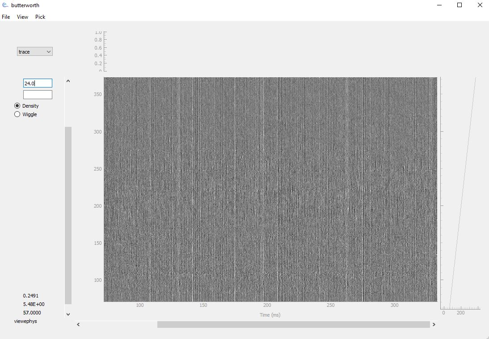

Interface guide
===============

This page walks through every part of the viewephys interface, section by section.
Each option is explained so you know what it does and when to use it.

----

Opening a file
--------------

When you launch viewephys with no arguments, the startup window appears:

.. image:: _static/gui_startup.png
   :alt: viewephys startup window showing dataset filter checkboxes
   :align: center
   :width: 80%

|

The **Dataset Info** panel shows checkboxes for the data streams detected in your
recording file. Check the stream you want to load, then use **File → Open** to
select your file.

.. list-table::
   :widths: 35 65
   :header-rows: 1

   * - Checkbox
     - What it loads
   * - **raw**
     - Unfiltered voltage traces straight from the probe. Includes all frequency
       content. Useful for checking the full signal before any processing.
   * - **AP band (high-pass 300Hz)**
     - Action potential band, high-pass filtered at 300 Hz. This removes slow LFP
       fluctuations and leaves spike-frequency activity. **This is the default and
       the most commonly used option.**
   * - **LF broadband (high-pass 2 Hz)**
     - Low-frequency / local field potential band, high-pass filtered at 2 Hz.
       Use this to inspect slower oscillations (theta, gamma, ripples).
   * - **AP band Destriped**
     - The AP band after destriping has been applied in-memory via
       ``ibldsp.voltage.destripe``. No separate pre-processed file is needed;
       destriping is computed on-the-fly from the raw data.

----

Selecting a file
----------------

Use **File → Open** to open the file picker:

.. image:: _static/gui_file_picker.png
   :alt: File picker dialog showing a Neuropixels .bin file selected
   :align: center
   :width: 80%

|

viewephys accepts ``*.bin``, ``*.cbin``, and ``*.dat`` electrophysiology files.
For Neuropixels recordings, select your ``*ap.bin`` or ``*ap.cbin`` file from SpikeGLX. 
If your data is in OpenEphys format, select the raw binary ``.dat`` file and 
provide the channel count and sampling rate manually.

The main trace view
-------------------

Once a file is loaded, the main trace window opens:

|

The trace area shows voltage across all channels (y-axis) over time (x-axis).

**Left panel controls**

.. list-table::
   :widths: 25 75
   :header-rows: 1

   * - Control
     - Description
   * - **dB Gain value** (number box, top left)
     - Current display gain in dB. Edit directly or use ``Ctrl+A`` / ``Ctrl+Z``
       to increase or decrease by 3 dB.
   * - **Sort** (below gain)
     - Type one or more header field names (space-separated) and press ``Enter``
       to re-order the displayed traces by those values. Multiple keys apply a
       hierarchical sort (rightmost key has highest priority). Leave blank to keep
       the original trace order.
   * - **Density** (radio button)
     - Renders signal intensity as pixel brightness. Best for an overview of all
       channels — noise, dead channels, and active regions are immediately visible.
   * - **Wiggle** (radio button)
     - Renders each channel as a waveform trace. Best for inspecting individual
       waveform shapes and verifying spike morphology.

**Status bar** (bottom left)

The three numbers in the bottom-left update as you move the cursor over the trace:

.. list-table::
   :widths: 25 75
   :header-rows: 1

   * - Value
     - Meaning
   * - First number
     - Time at cursor position (in seconds)
   * - Second number
     - Signal amplitude at cursor position
   * - Third number (bold)
     - Value of the selected header field for that channel (e.g. channel index
       when ``trace`` is selected in the header strip dropdown)

----

Mouse and keyboard controls
---------------------------

How to navigate the viewer:

.. list-table::
   :widths: 35 35 30
   :header-rows: 1

   * - Action
     - How
     - Where
   * - Scroll through time
     - Mouse wheel or drag horizontally
     - Ephys Bin viewer
   * - Switch channels
     - Scroll vertically around the channel number in the y-axis
     - butterworth viewer
   * - Zoom in / out in the trace view around the needed time and channel
     - Ctrl + scroll
     - butterworth viewer
   * - Increase gain
     - ``Ctrl + A``
     - butterworth viewer
   * - Decrease gain
     - ``Ctrl + Z``
     - butterworth viewer
   * - Switch display mode
     - Menu → **View** → Colormaps
     - butterworth viewer
   * - Link multiple windows
     -  ``Ctrl + P`` (synchronises pan, zoom, and gain)
     - butterworth viewer

To inspect a specific channel, hover over it —
the time, signal amplitude, and selected header field value update in real time in the bottom-left status bar.

----

The header strip dropdown
-------------------------

The dropdown in the top-left of the trace window selects which **header field**
is plotted in the thin strip alongside the main trace panel. The strip displays
the numeric value of the chosen field for each channel, giving a visual reference
of that channel property next to the traces. 

.. image:: _static/gui_channel_dropdown.png
   :alt: Channel property dropdown showing options trace, shank, col, row, flag, x, y, sample_shift, adc, ind
   :align: center
   :width: 95%

|

The options in the list are the keys of the header dictionary passed when the
data was loaded. ``trace`` (channel index 0, 1, 2 …) is always present. When
Neuropixels probe geometry is supplied, the list also includes fields such as
``shank``, ``col``, ``row``, ``x``, ``y``, ``sample_shift``, ``adc``, and
``ind`` — but the exact options depend entirely on what header data was provided.

.. tip::

   How to use this view: you notice something odd at channel 150 and want to know where it 
   sits on the probe. Select y from the dropdown, hover over that channel, and the status bar 
   shows its depth. Or select shank to instantly see the shank boundary in the strip and confirm 
   the channel is on shank 2.

----

The View menu
-------------

Access via **View** in the menu bar:

.. image:: _static/gui_view_menu.png
   :alt: View menu showing Colormaps submenu with CET_L2, MPL_PuOr, CET_D1, CET_D6
   :align: center
   :width: 95%

|

**Colormaps**

Changes the colour palette used in density mode:

.. list-table::
   :widths: 20 80
   :header-rows: 1

   * - Colourmap
     - Best used for
   * - **CET_L2** *(default)*
     - General purpose greyscale. Good for most recordings.
   * - **MPL_PuOr**
     - Purple-orange diverging map. Useful for highlighting both positive and
       negative deflections simultaneously.
   * - **CET_D1**
     - Blue-red diverging map. Alternative for bipolar signal visualisation.
   * - **CET_D6**
     - High-contrast diverging map. Useful when signal amplitude differences
       are subtle.

----

The Pick menu
-------------

Enable pick mode via **Pick → Pick** in the menu bar.

.. image:: _static/gui_pick_menu.png
   :alt: Pick menu showing Pick and Label channels options
   :align: center
   :width: 95%

|

.. list-table::
   :widths: 25 75
   :header-rows: 1

   * - Option
     - Description
   * - **Pick**
     - Enables manual spike picking mode. Left-click on the trace to mark a
       spike event. Shift+click to remove a nearby mark. Right-click or press
       ``Space`` to increment the spike group number. 
   * - **Label channels**
     - Toggle menu item. Not yet implemented — checking it has no effect.

----

Multi-window mode
-----------------

Open multiple viewephys windows (e.g. raw vs destriped) and press
``Ctrl + P`` to link them. Panning, zooming, and gain changes then
synchronise across all linked windows.

.. code-block:: python

   from viewephys.gui import viewephys
   import numpy as np

   # Two windows linked for comparison
   raw   = np.random.randn(384, 30_000) / 1e6
   clean = raw * 0.5  # simulated destriped data

   w = {}
   w['raw']   = viewephys(raw,   fs=30_000, title='raw')
   w['clean'] = viewephys(clean, fs=30_000, title='destriped')
   # Press Ctrl+P in either window to link them

----

Jump to a time point
--------------------

At the bottom of the viewer, the **Jump to** field lets you navigate
directly to a specific time:

1. Enter a time in **seconds** in the text box
2. Click **Go**

The trace view jumps to that position immediately.

----

Advanced usage
--------------

This page covers usage patterns beyond the interactive console —
running viewephys from a script, opening binary files programmatically,
and managing multiple windows.

----

Why ``create_app()``?
---------------------

When running viewephys interactively (IPython, Jupyter, or the command
line), the Qt application loop is managed for you. When running from a
**Python script**, you must create and start the Qt application yourself
using ``create_app()`` and ``app.exec()``.

----

Opening a binary file from a script
------------------------------------

.. code-block:: python

   from viewephys.gui import EphysBinViewer, create_app

   app = create_app()

   viewer = EphysBinViewer(r"C:\Data\recording_g0_t0.imec0.ap.bin")

   app.exec()

.. note::

   ``app.exec()`` must be the last line of your script. It starts the Qt
   event loop and blocks until the window is closed.

----

Loading a NumPy array from a script
-------------------------------------

.. code-block:: python

   import numpy as np
   from viewephys.gui import viewephys, create_app

   app = create_app()

   nc, ns, fs = 384, 50_000, 30_000
   data = np.random.randn(nc, ns) / 1e6  # Volts

   ve  = viewephys(data,      fs=fs)
   ve2 = viewephys(data * 50, fs=fs, title="plot 2")

   app.exec()

----

Opening multiple windows
------------------------

viewephys supports multiple simultaneous instances. Each window must
have a unique ``title``:

.. code-block:: python

   ve  = viewephys(raw,   fs=fs, title="raw")
   ve2 = viewephys(clean, fs=fs, title="destriped")

To synchronise pan, zoom, and gain across windows, press ``Ctrl + P``
in either window after both are open.

.. tip::

   Multiple windows are particularly useful for comparing raw vs
   destriped traces side by side. Open the same time window in both
   and use ``Ctrl + P`` to lock them together.