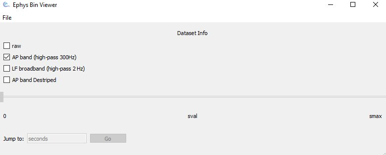
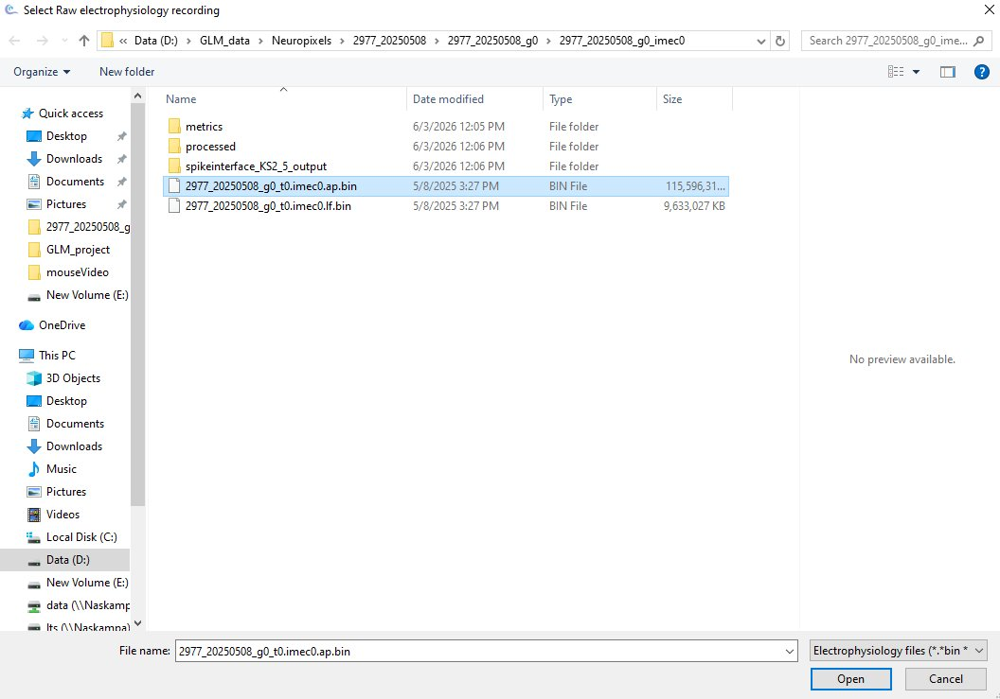
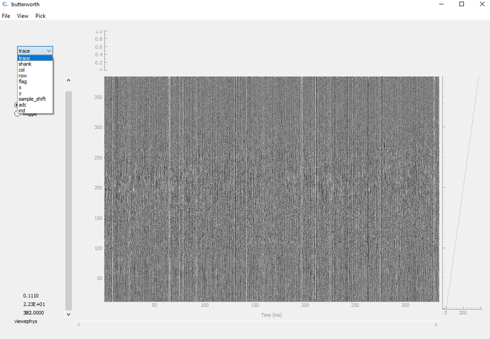
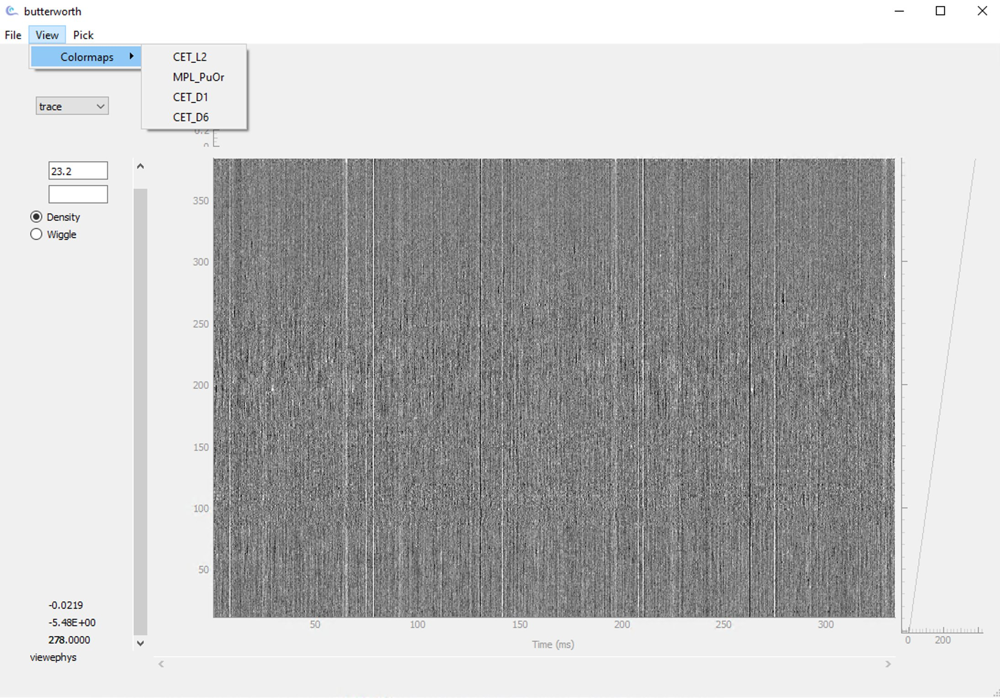
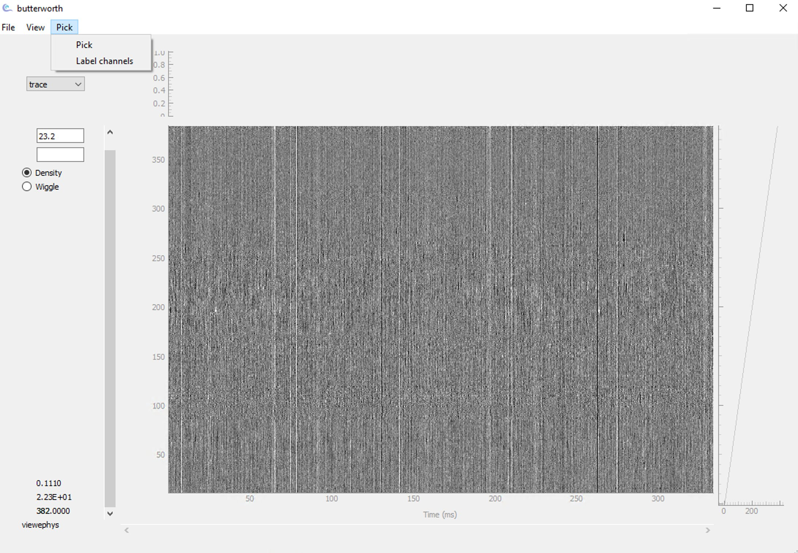

Interface guide
===============

This page walks through every part of the viewephys interface, section by section.
Each option is explained so you know what it does and when to use it.

----

Opening a file
--------------

When you launch viewephys with no arguments, the startup window appears:

|

The **Dataset Info** panel shows checkboxes for the data streams detected in your
recording file. Check the stream you want to load, then use **File → Open** to
select your file.

.. list-table::
   :widths: 35 65
   :header-rows: 1

   * - Checkbox
     - What it loads
   * - **raw**
     - Unfiltered voltage traces straight from the probe. Includes all frequency
       content — useful for checking the full signal before any processing.
   * - **AP band (high-pass 300Hz)**
     - Action potential band, high-pass filtered at 300 Hz. This removes slow LFP
       fluctuations and leaves spike-frequency activity. **This is the default and
       the most commonly used option.**
   * - **LF broadband (high-pass 2 Hz)**
     - Low-frequency / local field potential band, high-pass filtered at 2 Hz.
       Use this to inspect slower oscillations (theta, gamma, ripples).
   * - **AP band Destriped**
     - The AP band after destriping has been applied (noise band removal via
       ``ibldsp.voltage.destripe``). Only available if a destriped file exists
       alongside the raw binary.

.. tip::

   If you are new to the recording, start with **AP band (high-pass 300Hz)**.
   It gives the clearest view of neural spiking activity.

----

Selecting a file
----------------

Use **File → Open** to open the file picker:

|

viewephys accepts the following file types:

.. list-table::
   :widths: 20 80
   :header-rows: 1

   * - Extension
     - Description
   * - ``.bin``
     - Raw binary Neuropixels recording (SpikeGLX or OpenEphys format)
   * - ``.cbin``
     - IBL compressed binary format (requires ``mtscomp``)

The file picker filters for ``*.bin`` and ``*.cbin`` by default.
Your recording metadata file (``.meta`` or ``.ch``) should be in the same folder —
viewephys reads it automatically to determine the number of channels and sampling rate.

.. note::

   If no metadata file is found, viewephys will ask you to provide the channel
   count and sampling rate manually.

----

The main trace view
-------------------

Once a file is loaded, the main trace window opens:

.. image:: _static/viewephys_fullgui.jpg
   :alt: viewephys main trace window showing full probe depth, all channels, density mode
   :align: center
   :width: 95%

|

The trace area shows voltage across all channels (y-axis) over time (x-axis).

**Left panel controls**

.. list-table::
   :widths: 25 75
   :header-rows: 1

   * - Control
     - Description
   * - **Gain value** (number box, top left)
     - Current display gain in dB. Edit directly or use ``Ctrl+A`` / ``Ctrl+Z``
       to increase or decrease by 3 dB.
   * - **Colour box** (below gain)
     - Click to set a highlight colour for picked spikes.
   * - **Density** (radio button)
     - Renders signal intensity as pixel brightness. Best for an overview of all
       channels — noise, dead channels, and active regions are immediately visible.
   * - **Wiggle** (radio button)
     - Renders each channel as a waveform trace. Best for inspecting individual
       waveform shapes and verifying spike morphology.

**Status bar** (bottom left)

The three numbers in the bottom-left update as you move the cursor over the trace:

.. list-table::
   :widths: 25 75
   :header-rows: 1

   * - Value
     - Meaning
   * - First number
     - Voltage at cursor position (in Volts)
   * - Second number
     - Signal value in display units
   * - Third number (bold)
     - Channel number at cursor position

----

The channel property dropdown
-----------------------------

The dropdown in the top-left of the trace window controls what property is used
to **colour or sort** the channels on the y-axis:

|

.. list-table::
   :widths: 20 80
   :header-rows: 1

   * - Option
     - What it shows
   * - **trace** *(default)*
     - Raw voltage traces ordered by channel index. This is the standard view
       for inspecting signal quality.
   * - **shank**
     - Channels coloured by which shank they belong to. Useful for multi-shank
       probes (e.g. Neuropixels 2.0) to distinguish shanks visually.
   * - **col**
     - Channels coloured by their column position on the probe. Neuropixels probes
       have two columns of electrodes; this highlights the column layout.
   * - **row**
     - Channels coloured by their row position on the probe (depth along the shank).
   * - **flag**
     - Highlights channels that have been flagged (e.g. as bad channels) in the
       probe geometry file.
   * - **x**
     - Channels sorted by their x-coordinate (horizontal position on the probe face).
   * - **y**
     - Channels sorted by their y-coordinate (depth from tip). Useful for verifying
       that channel ordering matches expected anatomy.
   * - **sample_shift**
     - Shows the per-channel sample shift applied during ADC multiplexing correction.
       Relevant when checking time-alignment across channels.
   * - **adc**
     - Channels coloured by their ADC (analogue-to-digital converter) index.
       Useful for diagnosing ADC-specific noise patterns.
   * - **ind**
     - Channel index as recorded in the raw file, before any reordering.

.. tip::

   For most users, **trace** is the only option you need. The others are useful
   for hardware diagnostics and for verifying probe geometry.

----

The View menu
-------------

Access via **View** in the menu bar:

|

**Colormaps**

Changes the colour palette used in density mode:

.. list-table::
   :widths: 20 80
   :header-rows: 1

   * - Colourmap
     - Best used for
   * - **CET_L2** *(default)*
     - General purpose greyscale. Good for most recordings.
   * - **MPL_PuOr**
     - Purple-orange diverging map. Useful for highlighting both positive and
       negative deflections simultaneously.
   * - **CET_D1**
     - Blue-red diverging map. Alternative for bipolar signal visualisation.
   * - **CET_D6**
     - High-contrast diverging map. Useful when signal amplitude differences
       are subtle.

----

The Pick menu
-------------

Access via **Pick** in the menu bar:

|

.. list-table::
   :widths: 25 75
   :header-rows: 1

   * - Option
     - Description
   * - **Pick**
     - Enables manual spike picking mode. Left-click on the trace to mark a
       spike event. Shift+click to remove a mark. Space to increment the spike
       group number. See :doc:`controls` for the full reference.
   * - **Label channels**
     - Enables channel labelling mode. Click on a channel to assign it a label
       (e.g. marking it as a bad channel or a channel of interest).

----

Advanced usage
--------------

This page covers usage patterns beyond the interactive console —
running viewephys from a script, opening binary files programmatically,
and managing multiple windows.

----

Why ``create_app()``?
---------------------

When running viewephys interactively (IPython, Jupyter, or the command
line), the Qt application loop is managed for you. When running from a
**Python script**, you must create and start the Qt application yourself
using ``create_app()`` and ``app.exec()``.

----

Opening a binary file from a script
------------------------------------

.. code-block:: python

   from viewephys.gui import EphysBinViewer, create_app

   app = create_app()

   viewer = EphysBinViewer(r"C:\Data\recording_g0_t0.imec0.ap.bin")

   app.exec()

.. note::

   ``app.exec()`` must be the last line of your script. It starts the Qt
   event loop and blocks until the window is closed.

----

Loading a NumPy array from a script
-------------------------------------

.. code-block:: python

   import numpy as np
   from viewephys.gui import viewephys, create_app

   app = create_app()

   nc, ns, fs = 384, 50_000, 30_000
   data = np.random.randn(nc, ns) / 1e6  # Volts

   ve  = viewephys(data,      fs=fs)
   ve2 = viewephys(data * 50, fs=fs, title="plot 2")

   app.exec()

----

Opening multiple windows
------------------------

viewephys supports multiple simultaneous instances. Each window must
have a unique ``title``:

.. code-block:: python

   ve  = viewephys(raw,   fs=fs, title="raw")
   ve2 = viewephys(clean, fs=fs, title="destriped")

To synchronise pan, zoom, and gain across windows, press ``Ctrl + P``
in either window after both are open. See :doc:`controls` for the full
keyboard reference.

.. tip::

   Multiple windows are particularly useful for comparing raw vs
   destriped traces side by side. Open the same time window in both
   and use ``Ctrl + P`` to lock them together.