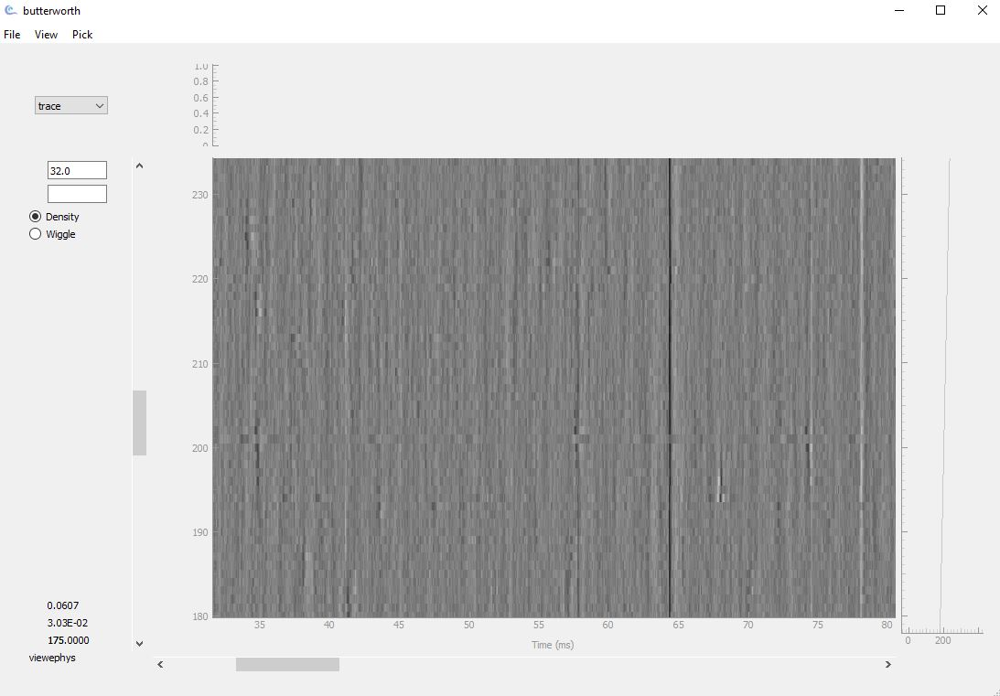

Quickstart
==========

This quickstart guide walks you through the basics of opening a recording and navigating the viewer.

----

Step 1 — Prepare your data
--------------------------

Make sure you have:

- A data file in one of the formats below

.. list-table::
   :widths: 20 80
   :header-rows: 1

   * - Extension
     - Description
   * - ``.bin``
     - Raw binary recording 
   * - ``.cbin``
     - IBL compressed binary format (requires ``mtscomp``)
   * - ``.dat``
     - OpenEphys raw binary format (requires manual metadata input)

- Knowledge of its sampling rate and channel count, usually available in an
  accompanying metadata file (``.meta`` or ``.ch``)

viewephys reads the metadata file (``.meta`` or ``.ch``) automatically
if it is in the same folder as your data file.

If no metadata file is found, you can load your data manually from Python:

.. code-block:: python

   import numpy as np
   from viewephys.gui import viewephys

   data = np.fromfile("recording.dat", dtype=np.int16).reshape(385, -1)
   data = data[:384, :]           # drop sync channel
   ve = viewephys(data / 1e6, fs=30_000)   # convert to Volts

Don't have a recording to hand? Download `this test dataset
<https://drive.google.com/drive/folders/1k2yyHH0XBNG8y4BgSm7R7tFD4SfA-QTs?usp=drive_link>`_
to see what a real recording and its metadata file look like.

For other formats (NWB, Nix, proprietary acquisition formats), convert
to binary first using `SpikeInterface <https://spikeinterface.readthedocs.io>`_.

.. note::

   Need to decompress ``.cbin`` files with
   ``mtscomp``? See the :doc:`faq` for details.

----

Step 2 — Launch the viewer
--------------------------

**From the command line**

.. code-block:: bash

   viewephys -f /path/to/your/recording.bin

The viewer opens immediately.

**From the GUI**

1. Launch the viewer with no arguments:

   .. code-block:: bash

      viewephys

2. From the menu bar, choose **File → Open**
3. Navigate to your raw file and select it

**Load from Python script**

If you are running through a script, you need to instantiate the Qt application yourself

.. code-block:: python

   from viewephys.gui import EphysBinViewer, create_app

   app = create_app()

   viewer = EphysBinViewer(r"C:\Data\recording_g0_t0.imec0.ap.bin")

   app.exec()

You can also load a NumPy array directly from a script:

.. code-block:: python

   import numpy as np
   from viewephys.gui import viewephys, create_app

   app = create_app()

   nc, ns, fs = (384, 50000, 30000)  # one second of Neuropixels data
   data = np.random.randn(nc, ns) / 1e6  # values in Volts

   ve = viewephys(data, fs=fs)
   ve2 = viewephys(data * 50, fs=fs, title="plot 2")

   app.exec()

----

Step 3 — Explore the interface
-------------------------------

Once the viewer opens, you will see a density-mode display:

|

.. note::

   This screenshot shows channels 180–230. The viewer loads all channels —
   scroll vertically to navigate the full probe depth.

- **Dark regions** — low activity or background noise
- **Light regions** — signal events (spikes, LFP deflections)
- **Vertical bright band** — electrical artefact (noise band affecting all channels simultaneously)
- **Status bar** (bottom left) — updates as you hover: time, signal
  amplitude, and selected header field value

See the :doc:`interface` guide for a full explanation.

----

Step 4 — Your first quality check
-----------------------------------

Follow this sequence when opening a new recording for the first time:

**1. Check the gain**

When the file first opens, the default gain may make the trace look flat
or clipped. Press ``Ctrl + A`` a few times to increase gain until
individual channels become visible.

**2. Identify noise bands**

Look for bright vertical stripes spanning all channels simultaneously.
These are electrical artefacts (often 50 or 60 Hz line noise), not neural
signal. Note their position in time: 
you will want to remove them with ``ibldsp.voltage.destripe()`` before sorting.

**3. Find a clean region**

Scroll to a region where channels show clear contrast: dark background
with bright deflections on a few channels. This indicates good
signal-to-noise ratio (SNR).

**4. Check for probe drift**

Scroll through time and watch whether active channels gradually shift
upward or downward. Gradual channel migration over time indicates probe
drift, which should be corrected before spike sorting.

----

Next steps
----------

Now that you can open and navigate a recording:

- Read the :doc:`interface` guide for a full explanation of every control
  and menu option
- See the :doc:`faq` for common issues
- Explore the `IBL documentation hub <https://docs.internationalbrainlab.org>`_
  for the next steps in the pipeline (destriping, spike sorting, quality
  metrics)